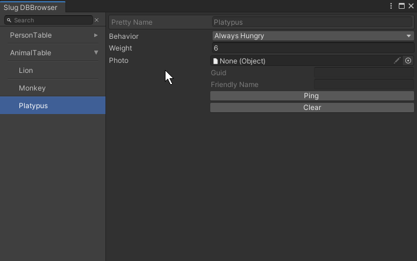
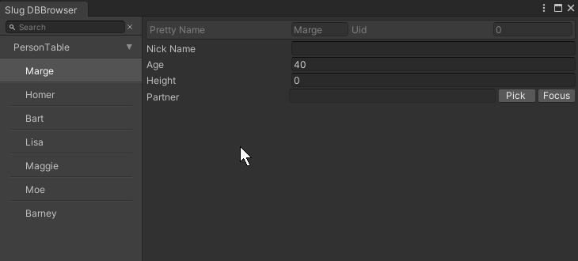
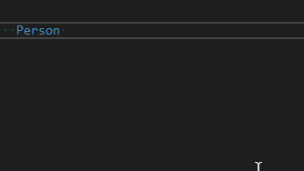

# SlugDB


The SlugDB is a database solution for Unity, **you'll need [Odin](https://odininspector.com/) to use it**.
SlugDB's goal is to combine Unity's powerfull editor scripting with a traditional database approach (think MySQL). It will allow you to make **typesafe queuries**. Most of the heavy lifting in terms of editor scripting will be left to Odin and will allow us to edit json text files in the Unity.

### Core concepts
The database is made of tables, tables contains rows (just like MySQL). For example you have a Person table and it is made of all your favourite characters (rows).

### Creating a table
To Create a table, create a class that inherits from Row (I recognize it is funny)
```c#
[Serializable]
public class Person : Row
{
    public string nickName;
    public int age;
    public int height;

    // a bit of boiler plate required at the moment
    public Person(string prettyName)
    {
        this.prettyName = prettyName;
    }
}
```

### The Browser window

Allow you to add rows, browse/edit your data. Don't forget to hit save when done! (Will either implement auto save or tint the window when a change is detected very soon)




### Cross referencing rows
If you wish to reference a row from any other row (whether they share the same type or not) you'll need to create an empty class like:

```c#
[Serializable]
public class PersonReference : RowReference<Person> {}
```
This will allow you to that:




### Accessing a row by code



### Searching
```c#
IEnumerable<Animal> heavyAnimals = Table<Animal>.Rows.Where( animal => animal.weight > 5 );
```

### Notes

* It's still very much a work in progress
* At the moment loading a table loads its entierty. So every row is deserialized and goes into memory.  The experimental branch looks at pure streaming and would fix that issue but it's not ready yet.
* SlugDB is designed for small to medium databases (at least at the moment) If you have to deal with json files that are 500MB it is not the right tool for you.
* Odin is obviously not included in the repository and you'll get compiler errors when cloning/downloading until you import it to your project)
* Minimum compatible version of Unity is 2018.3 since I'm using Addressables (via my ResourcesReference class). 
